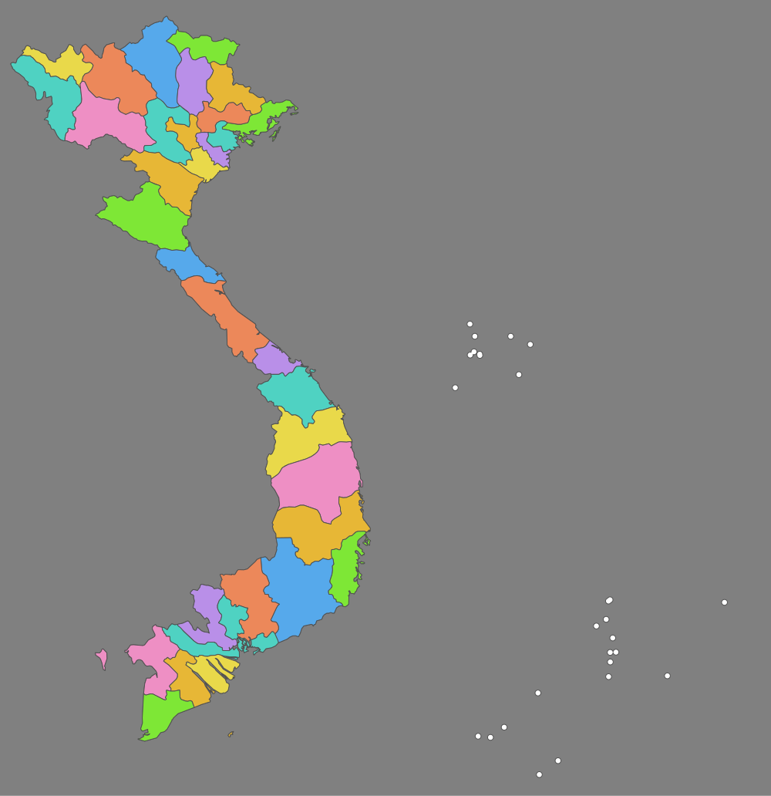
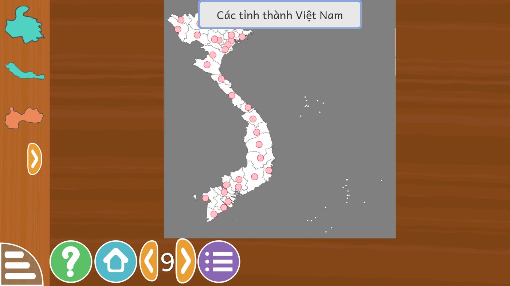

# Bản đồ hành chính 34 tỉnh thành Việt Nam — 02/09/2026

GCompris có bản đồ hành chính của Ý, Ấn Độ, Trung Quốc, Úc, Hoa Kỳ, Pháp, Đức,
Ba Lan, Na Uy, Argentina, Brazil… nhưng **không có Việt Nam**. Bản việt hoá này
bổ sung bộ bản đồ 34 tỉnh thành cho hoạt động *Tìm vùng trên bản đồ*
(`geo-country`), xếp vào bộ dữ liệu **"Các nước châu Á"**.

Đơn vị hành chính theo **Nghị quyết 202/2025/QH15** về sắp xếp đơn vị hành chính
cấp tỉnh — 34 đơn vị (28 tỉnh và 6 thành phố trực thuộc trung ương), hiệu lực
01/7/2025.





## Chủ quyền

Quần đảo **Hoàng Sa** và quần đảo **Trường Sa** vẽ đúng toạ độ thật trên lớp nền,
không đưa vào khung phụ, không lược bỏ. Khung bản đồ vì thế kéo ra tới kinh tuyến
117,6°Đ chứ không dừng ở bờ biển.

Hai quần đảo **không nhập vào mảnh kéo thả**. Nếu nhập, khung bao của mảnh Đà Nẵng
rộng 180 đơn vị và mảnh Khánh Hòa rộng 260 đơn vị trên khung 504 — mảnh chiếm nửa
bản đồ, phần lớn là biển trống, trẻ không cầm nổi và cũng không nhận ra hình. Quy
thuộc hành chính nói bằng tên gợi ý của hai mảnh đó:

- **Đà Nẵng (quản lý quần đảo Hoàng Sa)** — huyện đảo Hoàng Sa
- **Khánh Hòa (quản lý quần đảo Trường Sa)** — huyện đảo Trường Sa

## Nguồn dữ liệu và độ chính xác

Ranh giới lấy từ **Natural Earth 10m admin-1** (miền công cộng, không ràng buộc
bản quyền — hợp với AGPL của GCompris). Bộ này còn theo 63 tỉnh cũ nên phải hợp
nhất theo bảng sáp nhập: 11 đơn vị giữ nguyên, 23 đơn vị hợp nhất từ 52 tỉnh cũ.

Ba bản ghi trong Natural Earth bị đặt nhầm tên vùng thay vì tên tỉnh. Đã xác
định lại bằng toạ độ tâm và diện tích:

| Tên trong Natural Earth | Thực tế là | Tâm | Diện tích |
|---|---|---|---|
| Đông Nam Bộ | Đồng Nai | 11,06°B 107,20°Đ | ~5.978 km² |
| Vùng Đông Bắc | Bắc Kạn | 22,24°B 105,85°Đ | ~5.114 km² |
| Đồng Bằng Sông Hồng | Hưng Yên | 20,83°B 106,06°Đ | ~955 km² |

Đối chiếu diện tích 34 đơn vị với số liệu Nghị quyết 202/2025/QH15:

- **Tổng: 329.865 km² so với 331.334 km², lệch −0,4%.**
- 29/34 đơn vị lệch dưới 12%.
- Năm đơn vị lệch lớn, đều do chính Natural Earth chứ không do khâu hợp nhất:
  - **Điện Biên +23,5% và Lai Châu −34,8%** — đường ranh giữa hai tỉnh này bị đặt
    lệch về phía bắc. Cộng hai tỉnh lại chỉ lệch −4,9%.
  - **Quảng Ninh −15,7% và Hải Phòng −15,3%** — Natural Earth thiếu hẳn Cát Bà,
    Cát Hải, Bạch Long Vĩ và phần lớn đảo vịnh Hạ Long. Bộ lọc đảo nhỏ của công cụ
    chỉ bỏ 95 km², phần thiếu còn lại là của nguồn.
  - **Đồng Tháp −17,8%** — ranh giới vùng đồng bằng sông Cửu Long trong Natural
    Earth khá thô. Cộng cả năm đơn vị đồng bằng lại chỉ lệch −4,4%.

Với một trò xếp hình cho trẻ 2–10 tuổi thì mức này chấp nhận được, nhưng **không
nên dùng bộ này làm tài liệu tra cứu ranh giới hành chính.**

## Quy cách kỹ thuật

Đọc ngược từ bộ bản đồ Ý của GCompris, đã kiểm lại bằng số trên 20 mảnh của Ý:

- **Nền** `vietnam/vietnam.svgz`, khung **504×520**, gồm hình chữ nhật `fill:gray`
  phủ kín rồi **từng tỉnh vẽ riêng** `fill:#fff;stroke:#505050;stroke-width:.5`.
  Vẽ gộp thành một khối trắng thì học sinh không thấy ranh giới tỉnh nào — lỗi này
  đã mắc ở bản dựng đầu, người dùng phát hiện trên máy thật và đã sửa.
- **Mảnh** giữ nguyên hệ toạ độ của nền, cắt bằng `transform="translate(-minx -miny)"`,
  `width`/`height` bằng kích thước khung bao.
- **Vị trí** trong `board19_0.qml`: `x = tâm_x / 504`, `y = tâm_y / 520`. GCompris
  đặt mảnh theo `Babymatch.qml`: `x = posX * bề_rộng_nền − bề_rộng_mảnh / 2`, còn
  tỉ lệ mảnh lấy từ kích thước tự nhiên của chính tệp `.svgz` chia cho kích thước
  tự nhiên của nền — nên hai hệ toạ độ trùng khít, không có hệ số nào khác.
- **Phép chiếu** trụ đều (equirectangular), 32 đơn vị trên mỗi độ, gốc tại
  kinh 101,9°Đ vĩ 23,7°B.
- **Làm trơn** dung sai 0,006° (~0,66 km); bỏ đảo nhỏ hơn ~22 km² nhưng luôn giữ
  mảnh lớn nhất của mỗi tỉnh (Phú Quốc, Côn Đảo được giữ).
- **Tô màu** tham lam trên đồ thị kề, xoay điểm bắt đầu để dùng hết 8 màu.

## Cách dựng lại

```bash
# một lần: sinh tài nguyên (cần shapely + pyshp + Natural Earth 10m admin-1)
./.venv/bin/python tools/tao_ban_do_34_tinh.py <thư_mục_natural_earth> maps/34-tinh

# gắn vào gói .rcc của máy đích
scp neo@<ip>:/usr/share/gcompris-qt/rcc/geo-country.rcc /tmp/
./deploy/va_ban_do_34_tinh.sh /tmp/geo-country.rcc
scp /tmp/geo-country-vi.rcc neo@<ip>:/tmp/
ssh neo@<ip> 'sudo cp -n /usr/share/gcompris-qt/rcc/geo-country.rcc{,.orig}; \
              sudo cp /tmp/geo-country-vi.rcc /usr/share/gcompris-qt/rcc/geo-country.rcc'
```

Script tự kiểm khứ hồi `.rcc` trước khi sửa: bung ra rồi đóng lại y nguyên, so
từng byte; không khớp thì dừng. Trên NEO One đã kiểm 490/490 tệp khớp.

## Nghiệm thu trên NEO One thật

Máy `192.168.1.28`, `gcompris-qt 3.1-2`, Armbian bookworm aarch64.

| Việc | Kết quả |
|---|---|
| Khứ hồi `geo-country.rcc` của chính máy | ĐẠT — 490/490 tệp khớp từng byte (rcc v3) |
| Bản đồ vào bộ "Các nước châu Á" | ĐẠT — mức 9 trên tổng 19 mức |
| Tên bản đồ | ĐẠT — "Các tỉnh thành Việt Nam" |
| Nền hiện ranh giới 34 tỉnh | ĐẠT (sau khi sửa lỗi vẽ gộp) |
| Hai quần đảo hiện trên nền | ĐẠT |
| 34 chấm đích | ĐẠT — mỗi chấm nằm đúng trong ô tỉnh của nó |
| Tên gợi ý tiếng Việt | ĐẠT — bấm giữ mảnh hiện "Hải Phòng", "Lâm Đồng"… |

## Kiểm tự động

`tests/test_ban_do_34_tinh.py` — 41 test, trong đó bài quan trọng nhất tính ngược
toạ độ từ chính tệp `.svgz` rồi đối chiếu với con số trong `board19_0.qml`. Cả 8
quy tắc đều đã chứng minh biết fail bằng cách phá hỏng có chủ đích (xoá mảnh, đổi
toạ độ, dời khung bao, phình mảnh, đổi tên, xoá chấm đảo).

## Còn lại

- Nên nhờ người có chuyên môn bản đồ soát trước khi phát hành rộng, nhất là ranh
  giới Điện Biên – Lai Châu và phần đảo của Quảng Ninh, Hải Phòng.
- Cân nhắc thêm lời đọc tên 34 tỉnh thành vào kho giọng.
- Gửi ngược lên KDE để GCompris gốc cũng có bản đồ Việt Nam.
