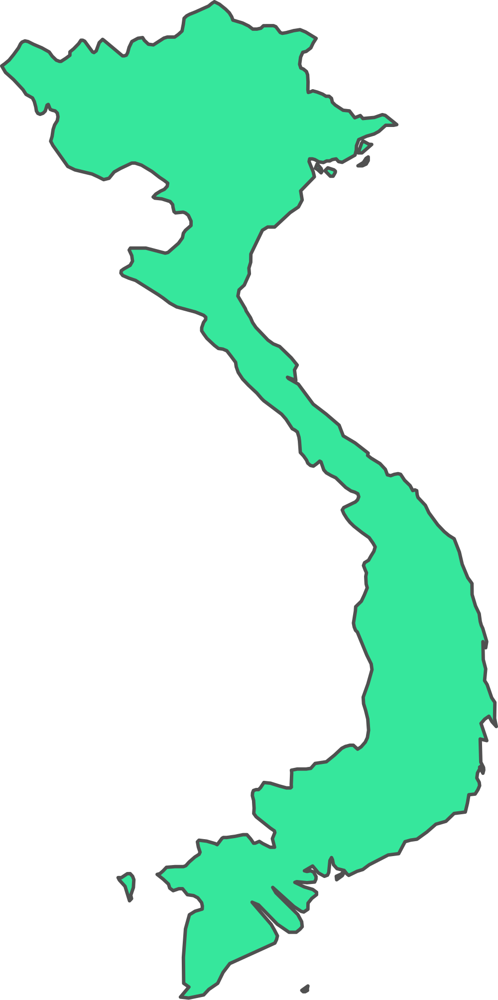
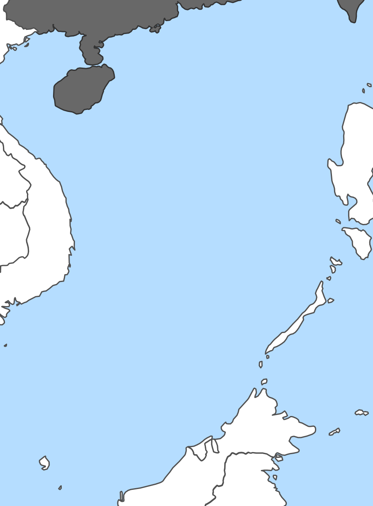
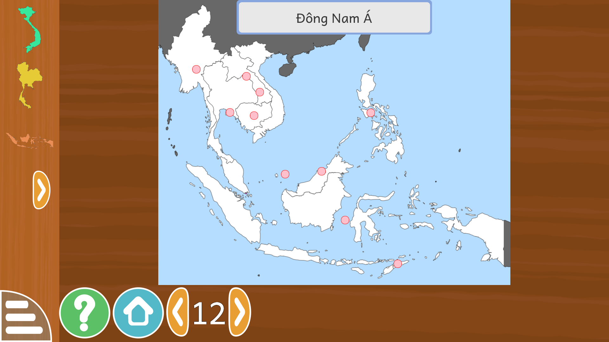
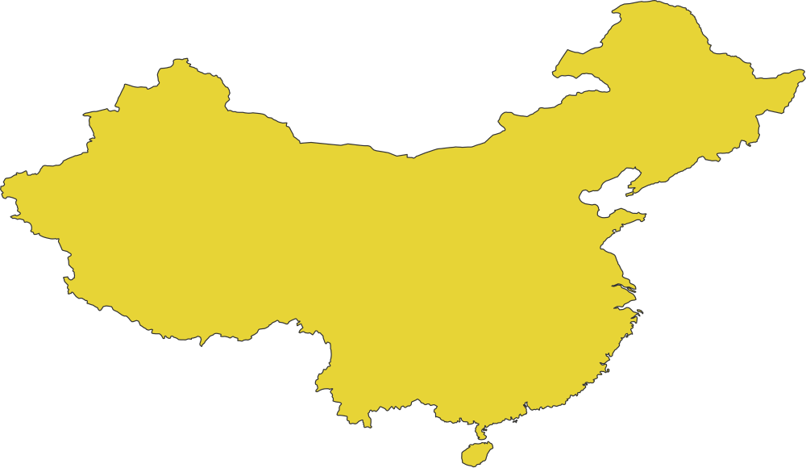

# Lưu ý về bản đồ và chủ quyền Việt Nam

**Ngày rà soát:** 02/09/2026 · **Người rà:** kiểm tra trực tiếp mã nguồn GCompris 26.1
và chạy thật trên NEO One (gcompris-qt 3.1-2).

> **KẾT LUẬN NGẮN: chưa được đưa hai hoạt động bản đồ vào lớp học ở dạng hiện tại.**
> Bản đồ Việt Nam trong GCompris **thiếu quần đảo Hoàng Sa và Trường Sa**.

## Hai hoạt động có bản đồ

| Hoạt động | Tên tiếng Việt | Nội dung |
|---|---|---|
| `geography` | Tìm quốc gia trên bản đồ | 14 cấp: châu lục, rồi từng vùng của thế giới. Cấp 12 là Đông Nam Á, có mảnh Việt Nam. |
| `geo-country` | Tìm vùng trên bản đồ | 18 bộ bản đồ hành chính: Ý, Ấn Độ, Trung Quốc, Úc, Mỹ, Pháp, Đức… **Không có Việt Nam.** |

## Bốn phát hiện

### 1. Bản đồ Việt Nam thiếu Hoàng Sa và Trường Sa — VẤN ĐỀ NẶNG NHẤT

Tệp `src/activities/geography/resource/asiasoutheast/vietnam.svgz` chỉ vẽ phần đất liền
cùng vài đảo ven bờ (Phú Quốc, Côn Đảo). **Không có quần đảo Hoàng Sa, không có quần đảo
Trường Sa.**

### 2. Biển Đông trên bản đồ nền hoàn toàn trống

Nền `asiasoutheast/southeast_asia.svgz` không vẽ bất kỳ đảo nào của hai quần đảo — không
gán cho ai cả, mà là **không tồn tại trên bản đồ**.

### 3. Điểm tích cực: KHÔNG có đường lưỡi bò

Bản đồ Trung Quốc (`asiaeast/china.svgz`) chỉ có phần đất liền và đảo Hải Nam. **Không có
đường chín đoạn, không lấn xuống Biển Đông, không gộp Hoàng Sa hay Trường Sa.** Đây là
điều đáng ghi nhận — nhiều phần mềm nước ngoài mắc lỗi này.

### 4. Đài Loan được liệt kê ngang hàng quốc gia

Cấp 13 "Đông Á" xếp Đài Loan thành một mảnh riêng, ngang với Trung Quốc, Nhật Bản, Hàn
Quốc, Triều Tiên, Mông Cổ. Việt Nam theo chính sách Một Trung Quốc và sách giáo khoa
Việt Nam không liệt Đài Loan là quốc gia. Nhà trường cần cân nhắc.

## Căn cứ pháp lý

**Nghị định 18/2020/NĐ-CP** ngày 11/02/2020 về xử phạt vi phạm hành chính trong lĩnh vực
đo đạc và bản đồ, hiệu lực từ 01/4/2020. Theo **Điều 11 khoản 2**, hành vi lưu hành sản
phẩm đo đạc và bản đồ, xuất bản phẩm bản đồ liên quan đến chủ quyền lãnh thổ quốc gia mà
không thể hiện hoặc thể hiện không đúng chủ quyền, biên giới quốc gia bị phạt tiền
**30–40 triệu đồng**, kèm tịch thu tang vật và buộc cải chính, sửa chữa sản phẩm.

Đã có nhiều vụ bị xử lý vì in bản đồ Việt Nam thiếu Hoàng Sa, Trường Sa trên áo, decal
xe, xuất bản phẩm và quảng cáo.

## Phải làm gì

### Ngay lập tức, trước khi đưa vào lớp

Khoá hai hoạt động **Tìm quốc gia trên bản đồ** và **Tìm vùng trên bản đồ** khỏi bản dùng
trong trường, hoặc chỉ mở những cấp không liên quan tới Việt Nam. Việc khoá làm được bằng
cách bỏ tệp `.rcc` tương ứng khỏi thư mục `rcc/` của máy.

### Sửa nội dung

1. **Vẽ lại `vietnam.svgz`**: thêm quần đảo Hoàng Sa và quần đảo Trường Sa vào cùng một
   mảnh với phần đất liền, để khi trẻ kéo mảnh Việt Nam thì hai quần đảo đi theo.
2. **Vẽ lại nền `southeast_asia.svgz`**: thêm hai quần đảo, có nhãn.
3. Làm tương tự với mảnh `continents/asia.svgz` nếu tỉ lệ cho phép.
4. **Bổ sung bộ bản đồ 34 tỉnh thành Việt Nam** cho `geo-country` — GCompris cho thêm bộ
   bản đồ mới mà không phải sửa mã nguồn.
5. Cân nhắc cách xử lý cấp Đông Á đối với Đài Loan.

### Khi gửi ngược lên KDE

Bản vá bổ sung Hoàng Sa và Trường Sa nên gửi lên kho GCompris của KDE kèm nguồn tham
chiếu. Đây là việc có ích cho cộng đồng, không chỉ cho bản Việt.

## Ghi chú

Bản dịch đã sửa xong phần tên gọi: 185 tên quốc gia và châu lục trước đây bị để nguyên
tiếng Anh nay đã dịch — **Việt Nam**, Trung Quốc, Lào, Campuchia, Thái Lan, Đài Loan,
Đông Nam Á, Các châu lục… Nhưng dịch tên không giải quyết được vấn đề hình vẽ.
