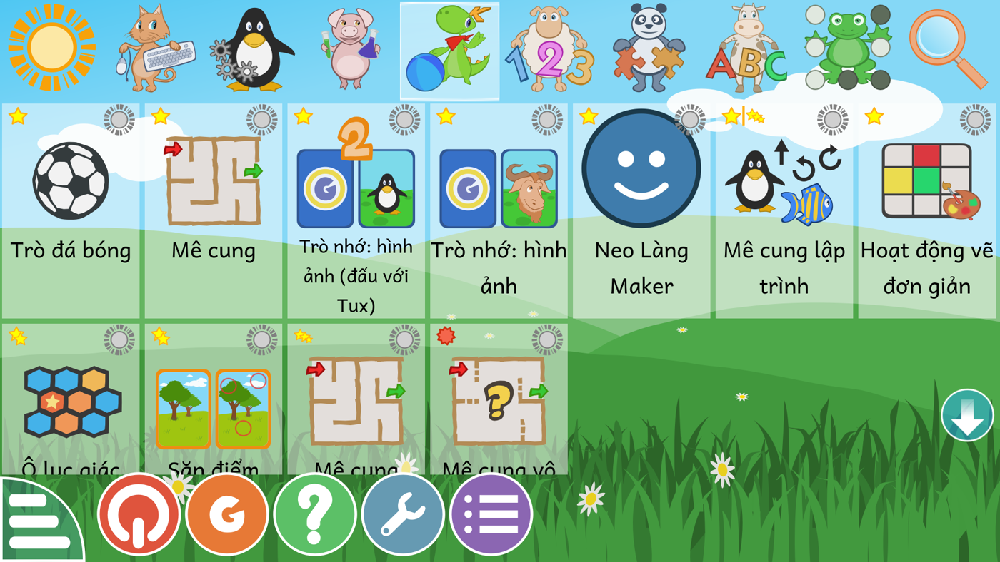
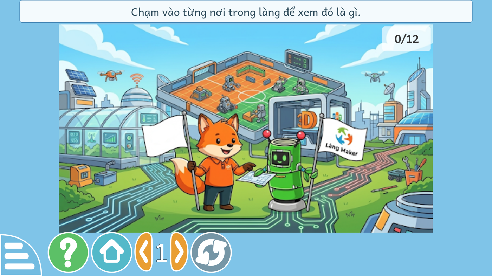

# Thêm mini app của Làng Maker vào GCompris — 02/09/2026

## Câu hỏi

1. Thay nhân vật Tux bằng nhân vật của làng trong mấy trò lập trình, mê cung được không?
2. GCompris có cơ chế thêm mini app không?

**Được cả hai, và không phải biên dịch lại C++.** Đã thử trên NEO One thật trước
khi viết tài liệu này.

## Cơ chế thêm mini app

`src/core/ActivityInfoTree.cpp` (hàm `initialize`, dòng 293–315):

1. Đọc danh sách tên hoạt động trong `activities_out.txt` — tệp text thuần nằm
   trong `activities.rcc`, mỗi dòng một tên thư mục, hiện có 183 dòng.
2. Với mỗi tên: `QResource::registerResource(<tên>.rcc)` — nạp gói tài nguyên
   **bên ngoài**, ở `/usr/share/gcompris-qt/rcc/`.
3. Rồi nạp `qrc:/gcompris/src/activities/<tên>/ActivityInfo.qml`.

Toàn bộ hoạt động là QML + JS + ảnh, nạp lúc chạy. Chương trình không hề biết
trước có những hoạt động nào. Vậy nên thêm một hoạt động mới chỉ cần:

- tạo `<tên>.rcc` chứa `gcompris/src/activities/<tên>/{ActivityInfo.qml, <Tên>.qml, <tên>.js, resource/…}`
- thêm một dòng tên vào `activities_out.txt` bên trong `activities.rcc`
- chép hai tệp `.rcc` vào thư mục `rcc/`

Đã kiểm bằng một hoạt động thử tối giản: máy hiện đúng hoạt động mới trong mục
Giải trí, có biểu tượng, có tên tiếng Việt, có nút yêu thích và mức sao như mọi
hoạt động gốc. Hoạt động thử đó đã gỡ khỏi máy sau khi kiểm xong.



## Kiến trúc: tách riêng để không vướng khi nâng đời

Yêu cầu là **vẫn cập nhật được GCompris gốc** mà không phải cấu hình lại. Ba
quy ước sau giữ được điều đó:

**1. Tiền tố tên riêng `lang_`.** Mọi mini app của Làng Maker đặt tên
`lang_maker`, `lang_…`. GCompris gốc không dùng tiền tố này nên danh sách hoạt
động không bao giờ đụng nhau, và việc gộp vào `activities_out.txt` chỉ là thêm
dòng vào cuối — không sửa, không xoá dòng nào của GCompris.

**2. Chỉ đụng đúng MỘT tệp của GCompris.** Đó là `activities_out.txt`. Mọi thứ
khác chỉ là thêm tệp `.rcc` mới. Nâng đời gói Debian xong, chạy lại
`deploy/gan_mini_app.sh` một lần là các mini app trở lại — script chạy lại được
nhiều lần, không nhân đôi dòng.

**3. Mục riêng "Làng Maker" trên hàng biểu tượng đầu màn hình.**


Hàng mục đó là một mảng JS thuần trong `Menu.qml`, mà `menu.rcc` cũng là tệp
ngoài — nên thêm mục mới chỉ là chèn một phần tử. GCompris lọc hoạt động bằng
`activity->section().indexOf(tag)` (`ActivityInfoTree::filterByTag`), tức là tìm
chuỗi con, nên hoạt động ghi `section: "langmaker discovery"` hiện ở **cả** mục
Làng Maker lẫn mục Khám phá. Không mục nào của bản gốc chứa chuỗi `langmaker`.

**Không dùng được mục mặt trời (Yêu thích) làm chỗ mặc định.** `ActivityInfo`
đọc lại cờ yêu thích từ thiết lập của người dùng ngay sau khi dựng
(`ActivityInfo.cpp:48`), nên giá trị khai trong `ActivityInfo.qml` bị ghi đè
mất. Mục Yêu thích là của người dùng tự bấm sao, không đặt sẵn được.

Thêm mục thứ 11 thì hàng biểu tượng tràn, mục cuối (Tìm kiếm) bị đẩy khỏi màn
hình: bản gốc lấy bề rộng biểu tượng bằng `main.width / (số mục + 1)` rồi nhân
1,1 thành bề rộng ô — vừa khít đúng 10 mục. Đã đổi thành `số mục × 1,15` để
tổng luôn bằng 96% màn hình. Công thức này nằm ở **bốn** chỗ: một chỗ khai mặc
định và ba chỗ trong các `state` ghi đè lại — sửa mỗi chỗ đầu thì state ghi đè
lên, mục thứ 11 vẫn bị cắt. Có một chỗ thứ năm trông giống nhưng là tính chiều
cao, phải chừa.

**4. Nhân vật NEO Tre là tài sản riêng, không vá đè lên Tux.**


`mini-app/chung/neo_tre.svg` — vẽ riêng bằng SVG, **không kèm cờ, không kèm
logo của bất kỳ đối tác nào**, để dùng được trong bản phát hành công khai. Công
cụ đóng gói chép thư mục `mini-app/chung/` vào `resource/chung/` của từng mini
app, nên đổi nhân vật một chỗ là đổi hết.

Vì sao **không** vá đè lên Tux: mỗi lần nâng đời GCompris là các gói `.rcc` gốc
bị ghi đè, phải vá lại; và bản tiếng Việt sẽ lệch khỏi bản gốc ở chỗ khó lần ra.
Nếu sau này vẫn muốn đổi nhân vật trong trò gốc thì chỉ cần đúng ba tệp:

| Tệp | Đổi thì đổi ở đâu |
|---|---|
| `maze/resource/tux_top_south.svg` | Mê cung, Mê cung vô hình, Mê cung tương đối, **Mê cung lập trình**, Đếm ngược, Mã hoá đường đi — bốn hoạt động sau dùng lại chính tệp này (`ProgrammingMaze.qml:224`) |
| `maze/resource/tux_shoes_top_south.svg` | như trên, lúc bật chế độ chạy nhanh |
| `core/resource/bonus/tux_good.svg`, `tux_bad.svg` | mặt cười / mếu cuối mỗi lượt, hiện ở **tất cả** hoạt động |

Tức là đổi một tệp `maze/resource/tux_top_south.svg` là đổi nhân vật cho cả sáu
trò mê cung và lập trình. Có 58 hoạt động khác còn nhắc Tux trong lời hướng
dẫn — đổi hình thì phải sửa cả chuỗi dịch cho khớp.

## Mini app đầu tiên: Làng Maker

`mini-app/lang_maker/` — trẻ đi thăm làng Maker qua một bức tranh toàn cảnh.



Mười hai nơi chạm được, mỗi nơi có tên và một câu giới thiệu:

| | |
|---|---|
| Sân đấu rô bốt | Màn hình Neo Sport |
| Nhà kính thông minh | Tấm pin mặt trời |
| Máy bay không người lái | Trạm phát sóng |
| Máy in ba chiều | Rô bốt ThingBot và bộ đồ nghề |
| Đường mạch điện | Bạn Cáo dẫn đường |
| Rô bốt NEO Tre | Chảo vệ tinh |

Ba cấp, theo lối vi thế giới của Papert — khám phá trước, gọi tên sau:

- **Cấp 1 — khám phá tự do.** Chạm vào đâu cũng đúng, không có sai. Chạm tới
  đâu hiện tên và lời giới thiệu tới đó. Tìm đủ mười hai nơi là xong. Trẻ dựng
  bản đồ trong đầu trước khi phải nhớ tên.
- **Cấp 2 — Cáo gọi tên.** "Tìm giúp Cáo: Rô bốt NEO Tre". Sáu câu.
- **Cấp 3 — Cáo chỉ tả việc.** "Cáo đố: Người bạn rô bốt của làng Maker, cầm
  bản vẽ đi cùng các bạn nhỏ. Đó là chỗ nào?" — không nói tên, phải suy ra.

### Kỹ thuật

Điểm chạm là hình tròn đặt trên tranh: tâm `(x, y)` theo phần của bề rộng và
chiều cao ảnh, bán kính `r` theo phần của **bề rộng**. Ảnh nền vẽ giữ đúng tỉ
lệ nên khi so khoảng cách giữa hai điểm phải quy cả hai trục về đơn vị bề rộng
— quên đổi thì bỏ lọt chồng lấn thật. Bản dựng đầu có năm cặp chồng nhau, đã
sửa hết.

Bảng tên đè lên mép dưới bức tranh chứ không chiếm chỗ trong bố cục, nhờ vậy
tranh to hết cỡ màn hình.

### Cách cài

```bash
scp neo@<ip>:/usr/share/gcompris-qt/rcc/{activities,menu}.rcc /tmp/
./deploy/gan_mini_app.sh /tmp/activities.rcc     # đóng gói app + thêm vào danh sách
./deploy/va_muc_lang.sh /tmp/menu.rcc            # thêm mục Làng Maker vào hàng biểu tượng
scp /tmp/activities-vi.rcc /tmp/menu-vi.rcc /tmp/lang_*.rcc neo@<ip>:/tmp/
ssh neo@<ip> 'sudo cp -n /usr/share/gcompris-qt/rcc/activities.rcc{,.orig}; \
              sudo cp -n /usr/share/gcompris-qt/rcc/menu.rcc{,.orig}; \
              sudo cp /tmp/lang_*.rcc /usr/share/gcompris-qt/rcc/; \
              sudo cp /tmp/activities-vi.rcc /usr/share/gcompris-qt/rcc/activities.rcc; \
              sudo cp /tmp/menu-vi.rcc /usr/share/gcompris-qt/rcc/menu.rcc'
```

Script kiểm khứ hồi `.rcc` trước khi sửa, không khớp từng byte thì dừng.

### Kiểm tự động

`tests/test_mini_app_lang.py` — 31 test cho dữ liệu điểm chạm. Chín quy tắc đều
đã chứng minh biết fail bằng cách phá hỏng có chủ đích: xoá điểm, trùng mã,
trùng tên, đẩy điểm tràn mép, cắt cụt lời mô tả, dời cho hai điểm chồng nhau,
thu bán kính quá nhỏ, xoá tệp ảnh, thêm chữ vào hình nhân vật dùng chung.

`tests/test_va_muc_lang.py` — 6 test cho bộ vá menu, cũng đã chứng minh biết
fail: không nới bề rộng, vá lấn sang dòng tính chiều cao, đặt sai chỗ trong
mảng, chạy lại bị nhân đôi, không dừng khi số chỗ công thức đổi, không dừng khi
không nhận ra mảng mục.

## Bản quyền ảnh nền

Bức tranh gốc có logo **FPT Telecom** trên lá cờ bên trái. Kho `gcompris-vi` là
kho công khai theo AGPL v3 nên đã **gỡ logo đó ra**, giữ nguyên lá cờ trắng và
giữ nguyên logo **Làng Maker** bên phải.

Cách gỡ: loang trên vùng vải trắng của lá cờ (rào chắn là nét viền tối) để lấy
đúng lòng cờ, rồi tô trắng mọi điểm ảnh trong đó còn ám màu hoặc còn xám. Chỉ
tô lại 730 điểm ảnh, nét viền và hình dáng lá cờ giữ nguyên. Lần tô đầu chỉ bỏ
những điểm tối hơn ngưỡng nên còn sót viền khử răng cưa nhạt của chữ FPT — phải
bắt theo cả độ ám màu mới sạch.

Trên áo bạn Cáo còn một phù hiệu nhỏ ở ngực, ở độ phân giải 512 px thì chỉ là
một vệt sáng không đọc ra chữ gì. Nếu có bản gốc lớn hơn thì cần soát lại chỗ đó.

## Còn một việc về ảnh

Ảnh nền chỉ **512×286**. Trên màn hình 1920 phải phóng lên gần ba lần nên hơi
mờ. Cần bản gốc rộng ít nhất 1600 px.

## Còn lại

- Lời đọc tiếng Việt cho mười hai nơi (dùng lại đường ống VieNeu-TTS đã có).
- Mini app thứ hai: lập trình đường đi cho NEO Tre trong làng, theo lối
  `programmingMaze` nhưng bối cảnh Làng Maker.
- Bấm nút trên thanh dưới bằng `xdotool` cho toạ độ lệch nên chưa tự động hoá
  được việc đổi cấp khi chụp ảnh; cấp 2 và 3 đã kiểm bằng bản dựng tạm khởi
  động thẳng vào cấp đó.
- Ảnh nền độ phân giải cao hơn.
