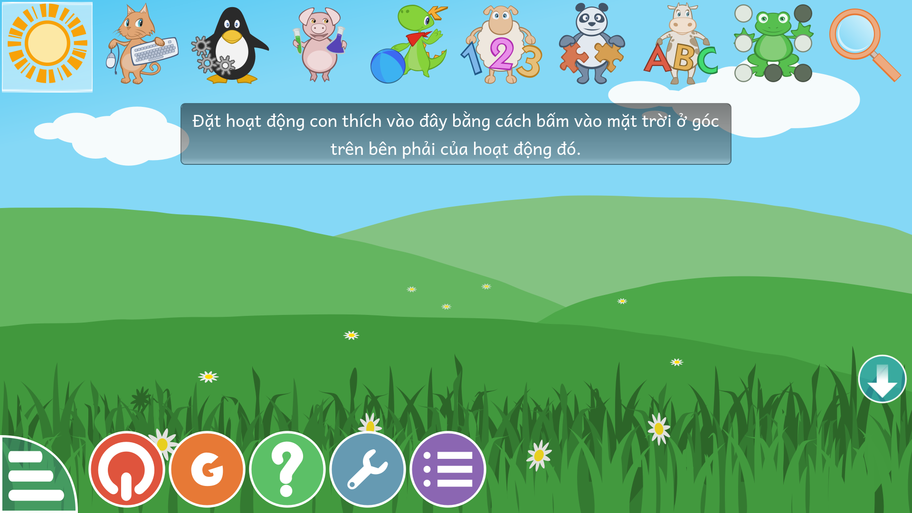
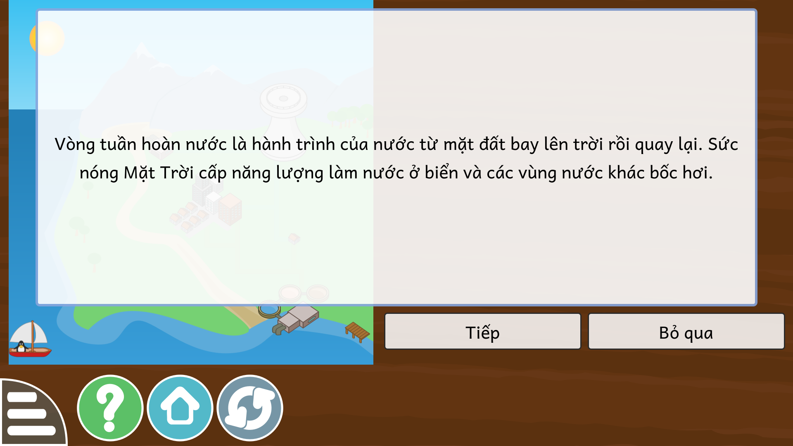
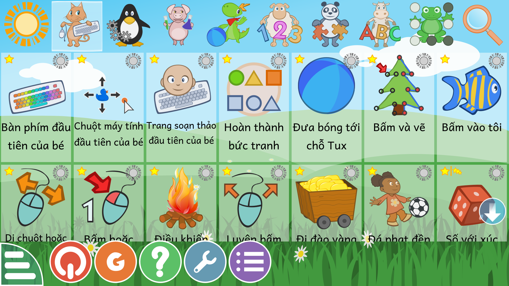
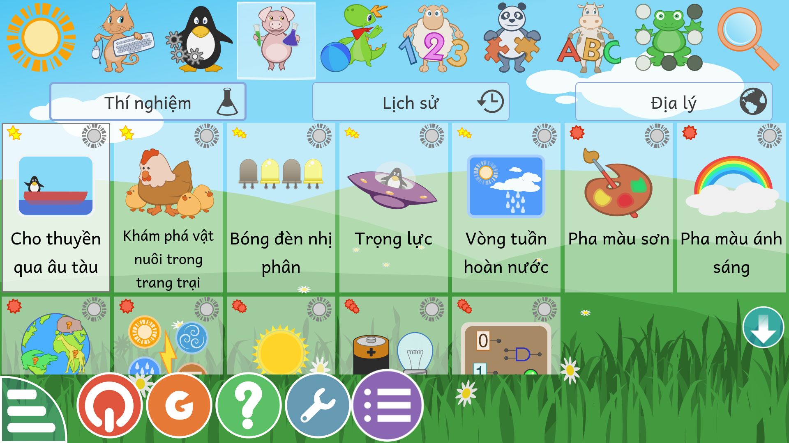

# Nghiệm thu trên NEO One thật — 01/09/2026

Máy: NEO One, ThingEdges-Armbian 25.11 bookworm, aarch64, `192.168.1.28`.
GCompris: gói Debian `gcompris-qt 3.1-2` (không phải bản 26.1 mà bản dịch dựng theo).

## Kết quả

| Việc | Kết quả |
|---|---|
| Vá `core.rcc` để nhận locale `vi_VN` | ĐẠT — không còn dòng `locale "vi_VN.UTF-8" not supported` |
| Khứ hồi `.rcc` trên chính tệp của máy | ĐẠT — 140/140 tệp khớp từng byte (rcc v3) |
| Nạp bản dịch `.qm` | ĐẠT — menu chính và hoạt động hiện tiếng Việt, dấu đúng |
| Đăng ký kho giọng | ĐẠT — `Successfully registered resource ".../voices-ogg/voices-vi.rcc"` |
| Độ phủ bản dịch trên bản 3.1 | 3.509/3.790 chuỗi của máy trùng với po 26.1 (93%), trong đó 2.891 đã dịch |





## Hai lỗi người dùng phát hiện, đã sửa

**1. Nhiều tên hoạt động vẫn ra tiếng Anh.** Ảnh chụp màn hình cho thấy "Baby keyboard",
"Baby mouse", "A baby word processor". Nguyên nhân: bản 3.1 dùng lời cũ, còn po dựng
theo bản 26.1 đã đổi lời (thành "My first keyboard"…). Có **281 chuỗi** như vậy.
Cách chữa: thêm catalog `po/gcompris_qt_doi-cu.po` chứa đúng những chuỗi đời cũ,
`tools/build_qm.sh` gộp cả hai vào một tệp `.qm`. Sau khi sửa, độ phủ trên máy đi từ
2.891 lên **3.100/3.790 chuỗi**; 690 chuỗi còn lại thì 676 nằm trong danh sách cố ý giữ
nguyên và 14 là tên riêng, đơn vị — tiếng Việt viết y hệt.

**2. "Vận hành âu thuyền" là dịch sai.** *Âu thuyền* là vũng kín để tàu thuyền tránh
bão; công trình nâng hạ mực nước cho tàu qua như ở kênh Panama gọi là **âu tàu**.
Đã sửa tên hoạt động thành **"Cho thuyền qua âu tàu"** và sửa cả 5 chuỗi liên quan
cùng lời đọc trong kho giọng.





## Ba điều học được trên máy thật

**1. Đường dẫn kho giọng đổi theo đời GCompris.** Bản 3.1 tìm ở
`~/.cache/KDE/gcompris-qt/data2/voices-ogg/voices-vi.rcc` — thư mục `data2`, có `KDE`
ở giữa, và tên tệp KHÔNG có ngày tháng. Bản 4.x và 26.x dùng `data3` và tên có ngày,
đọc từ tệp `Contents`. `deploy/install_vi.sh` nay cài vào cả ba chỗ.

**2. Bản đóng gói Debian đặt `.qm` theo tên cũ.** Là `gcompris_vi.qm` chứ không phải
`gcompris_qt_vi.qm`. Script tự dò theo tên các tệp đã có trong thư mục.

**3. Muốn chụp màn hình phải chạy kết xuất phần mềm.** GCompris vẽ bằng OpenGL nên
`xwd` chỉ chụp ra ảnh trắng. Chạy `--software-renderer` thì chụp được. Đây chỉ là vấn
đề của việc chụp ảnh, chạy bình thường vẫn dùng OpenGL.

## Cách lặp lại

```bash
# trên máy có Qt (Mac): vá core.rcc của chính máy đích
scp neo@192.168.1.28:/usr/share/gcompris-qt/rcc/core.rcc /tmp/
.venv/bin/python tools/rcc_extract.py /tmp/core.rcc /tmp/x
#   chèn { "text": "Tiếng Việt", "locale": "vi_VN.UTF-8" }, vào LanguageList.qml
.venv/bin/python tools/rcc_repack.py /tmp/x /tmp/core-vi.rcc --version 3

# trên NEO One
sudo cp core-vi.rcc /usr/share/gcompris-qt/rcc/core.rcc
sudo cp gcompris_qt_vi.qm /usr/share/gcompris-qt/translations/gcompris_vi.qm
mkdir -p ~/.cache/KDE/gcompris-qt/data2/voices-ogg
cp voices-vi-*.rcc ~/.cache/KDE/gcompris-qt/data2/voices-ogg/voices-vi.rcc
#   đặt locale=vi_VN.UTF-8 và enableAutomaticDownloads=false trong
#   ~/.config/gcompris/gcompris-qt.conf
```
